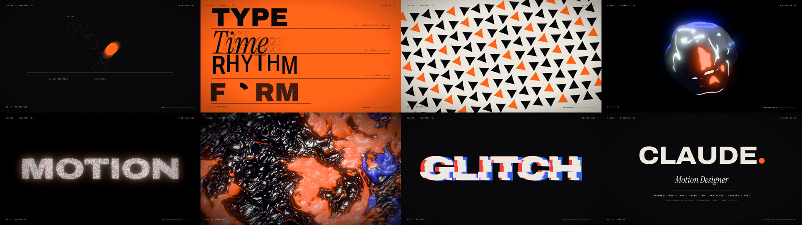

# XForward ad campaign: HyperFrames concepts

Ad concepts, each a [HyperFrames](https://github.com/heygen-com/hyperframes)
composition (HTML + GSAP, rendered to MP4).

| | Concept | Format | Idea |
|---|---|---|---|
| A | 9:42 PM | 9:16 · 15 s | Night lead nobody answers, then the agent books it in 38 s |
| B | Hours | 1:1 · 13 s | Kinetic type: wasted hours count up, tasks crossed out |
| C | Terrain | 16:9 · 15 s | The site's topographic map rises into a 3D mountain, then flattens |
| D | Help Wanted | 9:16 · 14 s | Newspaper classified for an impossible hire, stamped "It's an AI agent" |
| E | The Receipt | 1:1 · 13 s | A receipt totals the week's wasted time in dollars, stamped "Recovered" |

Round 1 (above) was rejected as too literal. Low-res silent drafts: `drafts/round1/`.

## Round 2: premium (Apple / Stripe) x manifesto (Nike), awe-first hook

| | Concept | Format | Idea |
|---|---|---|---|
| 1 | Chrome X | 16:9 · 15 s | Glossy 3D arrows in studio light lock into the X; 4-beat manifesto |
| 2 | Tunnel | 9:16 · 14 s | Fly through a tunnel of busywork words; beat cuts; "Your people deserve better work" |
| 3 | Hours | 1:1 · 15 s | 20,000 particle "hours" trapped in circles, then streaming forward into the X |

Source: `build2.py` (Three.js scenes driven by HyperFrames `hf-seek` time, GSAP for
type) and `synth.py` (placeholder beat tracks, pure Python). Drafts with sound:
`drafts/round2/`.

## Round 3: recognition hook ("that's me"), premium craft

| | Concept | Format | Idea |
|---|---|---|---|
| 1 | 11:47 PM | 9:16 · 15 s | Night lock screen flooded with admin notifications; the agent clears them: "Go to bed." |
| 2 | Starring: You | 16:9 · 15 s | Movie credits: Receptionist: You, Night shift: You… "Time to recast." → Agent. CEO: You. |
| 3 | Sunday | 1:1 · 15 s | Admin fills every evening and Sunday; blocks fly to "Agents · 24/7": "Your Sundays. Back." |

Source: `build3.py` (GSAP + synthesized pings/whooshes/hits). Drafts: `drafts/round3/`.

## Round 4: clear message (what we do, what the business wins)

| | Concept | Format | Idea |
|---|---|---|---|
| 1 | How it works | 16:9 · 20 s | Blueprint of a business: engineer walks in, hours found (27 h/wk), agents take over; results + CTA |
| 2 | Same day | 9:16 · 18 s | Split screen, same day without vs with agents; lead/quote/PO/call/invoice outcomes; score |
| 3 | The offer | 1:1 · 15 s | "We put AI agents to work in your business" + 6 weeks · <60 s · 27 h · 1 fixed price + CTA |

Source: `build4.py`. Drafts: `drafts/round4/`. Numbers are illustrative targets.

## Round 5: same clear message, four different styles and formats

| | Style | Format | Message |
|---|---|---|---|
| 1 | Bauhaus poster | 4:5 · 16 s | Tasks = red circles in chaos; agents = blue squares that put them in order |
| 2 | Whiteboard | 16:9 · 20 s | Consultant sketches the business, circles time-wasters, draws engineer + agents, ticks wins |
| 3 | Warm & human | 9:16 · 16 s | "5:00 PM. The shop is closed. But the work isn't." → "Dinner at home. Weekends off." |
| 4 | Neo-brutalist | 1:1 · 15 s | What they do → what you win → how → pressable "Book a free call" |

Source: `build5.py`. Drafts: `drafts/round5/`.

## Showreel: CLAUDE — Motion Designer (15 s, 1080p)

A résumé showreel: one orange dot travels through eight disciplines, one bar of
128 BPM each, every cut on the beat.

| Bar | Time | Shot | What it shows |
|---|---|---|---|
| 1 | 0:00 | Principles | Bouncing ball: anticipation, arcs, squash & stretch, onion skins, motion blur, splat |
| 2 | 1.9 s | Typography | Variable-font width axis, echo trail, bouncing stagger; zoom through the O's counter |
| 3 | 3.8 s | Geometry | 144-shape grid morphing circle → square → triangle → star in stagger waves |
| 4 | 5.6 s | 3D | Match cut to a lacquer sphere → noise blob → chrome → 150-sphere burst → double helix |
| 5 | 7.5 s | Particles | 40k GPU particles: supernova ring, spiral galaxy, "MOTION" |
| 6 | 9.4 s | Shaders | Domain-warped liquid with beat ripples; pull out through the letters of "FLUID" |
| 7 | 11.3 s | Editing | Six half-beat micro-shots (split, spiral, counter, glitch, flip grid, circular type) + 3-2-1 |
| 8 | 13.1 s | Title | The dot pops again and becomes the period of "CLAUDE." |

Source: `showreel/build_reel.py` (DOM shots in GSAP; 3D/particles/shaders in one
Three.js canvas with a hand-written bloom + tonemap pass) and
`showreel/reel_synth.py` (128 BPM A-minor track, synthesized in Python, mixed
with FFmpeg). Video: `showreel/claude-showreel-2026.mp4` (1080p30, web encode; the
full-quality master renders in about 3 minutes on 4 cores).



## Build and render

Needs Node 22+, FFmpeg, and the HyperFrames CLI (`npm i -g hyperframes`,
then `hyperframes browser ensure`).

```bash
python3 build.py            # round 1 low-res drafts -> projects/<concept>/
python3 build2.py           # round 2 low-res drafts (Three.js + audio)
python3 build3.py           # round 3 low-res drafts (recognition hooks + audio)
python3 build4.py           # round 4 low-res drafts (clear message + audio)
python3 build5.py           # round 5 low-res drafts (four visual styles)
python3 build.py --final    # full resolution (1080x1920, 1080x1080, 1920x1080)
python3 showreel/build_reel.py --zoom 1   # showreel -> projects/showreel/ (default: 960x540 draft)
cd projects/a-942pm && hyperframes render -q draft -f 24 -o ../../a.mp4
```

Each concept is authored at full design size inside a `.stage` scaled with
CSS `zoom`, so the same source renders drafts and finals. Fonts and GSAP are
bundled locally because the renderer cannot fetch from CDNs.
